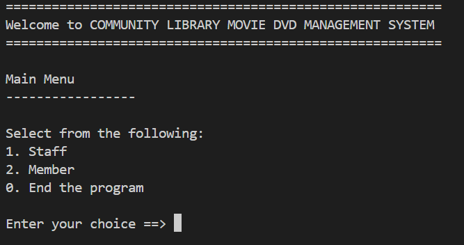
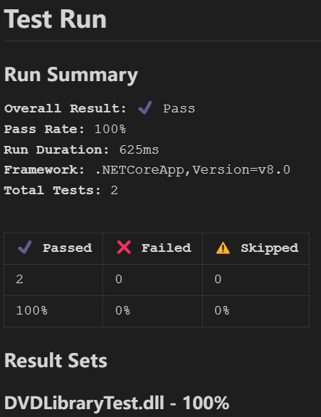

# DVD Library Management System

 A console app project written in C# for the purpose of using Data Structures & Algorithms

- Member management
- Movie management

# Algorithm and Data Structures in C#

 C# library of data structures were not used in implementation of the project.

 Featuring Hashtable, Binary Search Tree and Mergesort Alogrithms

# Hashtable

 Hashtable has been implemented to manipulate Movie Collection

# Binary Search Tree

 BST has been implemented to manipulate Member Collection

# MergeSort

 MergeSort has been implemented in

- Sort Top 3 of most frequent borrow movies of a member
- Sort and display all movies in the library in Dictionary order

## Run Locally

  Clone repo to local environment using VS Code

```bash
  git clone https://github.com/EWU0001/Algorithms.git
```

Go to the project directory

```bash
  cd DVDLibrary
```

```bash
  cd DVDManagement
```

Run command

```bash
  dotnet run
```
## Screenshots
Program Main Menu



## Running Tests

Xunit test written for "MainMenu Staff Auth". Run test and generate Markdown test result (find in "/DVDLibraryTest/TestResults").

```bash
  cd DVDLibraryTest
```

```bash
  dotnet test --logger "liquid.md"
```
## Screenshots
Sample of Test report



Test Report output generated by Liquid Test Reports. Visit [LiquidTestReports](https://github.com/kurtmkurtm/LiquidTestReports) for more test report generation

